# Fluxograma metodológico — Etapa 2

Exportar para PNG (Mermaid Live Editor ou extensão VS Code) e incluir no PDF e nos slides.

```mermaid
flowchart LR
  dados[Kaggle Pig Dataset] --> split["pig/train 929 + pig/val 136"]
  split --> prep[YAML pig_dataset.yaml]
  prep --> treino[Treino autoral E01 E02 E03]
  treino --> val["Avaliacao pig/val conf 0.25"]
  val --> metricas["P R mAP F1 tempo"]
  metricas --> comp[Comparacao v5 v8 v11]
  comp --> relatorio[Relatorio Etapa 2]
```

## Etapas (texto para o relatório)

1. **Aquisição dos dados** — Kaggle Pig Dataset, anotações YOLO.
2. **Pré-processamento** — verificação de anotações (Etapa 1); geração do YAML.
3. **Divisão treino/validação** — hold-out fixo 929/136.
4. **Treinamento** — três detectores autorais (pesos COCO → checkpoints próprios).
5. **Ajuste de hiperparâmetros** — protocolo fixo (`seed=42`, early stopping); sem busca exaustiva.
6. **Avaliação** — métricas de detecção no mesmo val.
7. **Comparação** — E01 vs E02 vs E03 (foco mAP@0.50:0.95).
8. **Interpretação** — hipóteses H1/H2 e limitações.
