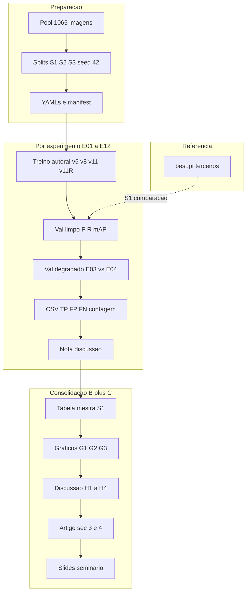

# Fluxograma B+C — Metodologia e Resultados integrados

Exportar para PNG/SVG (Mermaid Live Editor ou VS Code).

```mermaid
flowchart TB
  subgraph prep [Preparacao]
    P1[Pool 1065 imagens]
    P2[Splits S1 S2 S3 seed 42]
    P3[YAMLs e manifest]
  end

  subgraph exp [Por experimento E01 a E12]
    T[Treino autoral v5 v8 v11 v11R]
    V1[Val limpo P R mAP]
    V2[Val degradado E03 vs E04]
    R[CSV TP FP FN contagem]
    D[Nota discussao]
  end

  subgraph consol [Consolidacao B plus C]
    C1[Tabela mestra S1]
    C2[Graficos G1 G2 G3]
    C3[Discussao H1 a H4]
    C4[Artigo sec 3 e 4]
    C5[Slides seminario]
  end

  subgraph ref [Referencia]
    REF[best.pt terceiros]
  end

  P1 --> P2 --> P3 --> T
  T --> V1 --> V2 --> R --> D
  D --> C1 --> C2 --> C3 --> C4 --> C5
  REF -.->|S1 comparacao| V1
```
